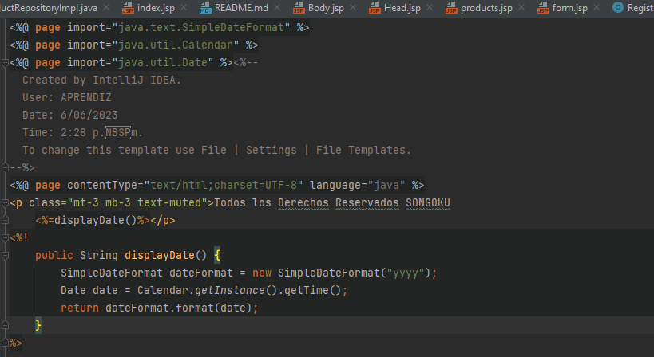
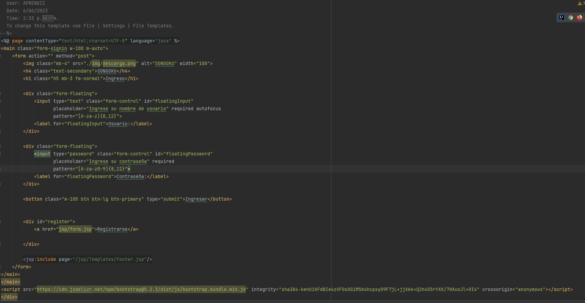
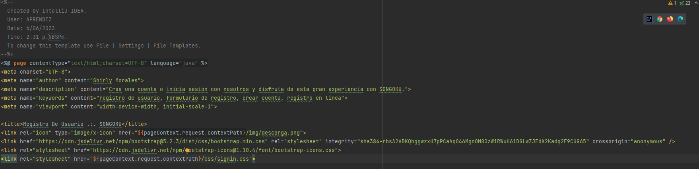
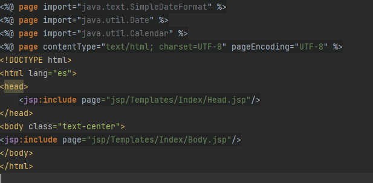

# TALLER-8-JAVA
Cree la carpeta templates en la cual cree un jsp llamado footer. 

en esa misma carpeta cree otra que se llama index esta trae todo lo que es el body y el head de la estructura body.

en la carpeta webapp donde se encuentra index los estoy llamando

